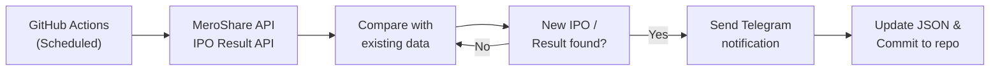

<p align="center">
  
</p>

<p align="center">
  <a href="#features"></a>
  <a href="#setup"></a>
  <a href="#how-it-works"></a>
</p>

<p align="center">
  
  
  
  
</p>

<p align="center">
  <b>🇳🇵 Automated IPO monitoring for Nepal's MeroShare with instant Telegram notifications</b>
</p>

---

## ✨ Features

<table>
<tr>
<td width="50%">

### 📈 IPO Monitoring

- Real-time tracking of new IPOs
- Automatic detection of newly listed shares
- Supports all share types (IPO, FPO, Rights, etc.)

</td>
<td width="50%">

### 🔔 Instant Alerts

- Telegram notifications when new IPOs open
- IPO result announcements
- Beautiful formatted messages

</td>
</tr>
<tr>
<td width="50%">

### ⚡ Fully Automated

- Runs on GitHub Actions (free!)
- Scheduled checks every 2 hours
- Zero maintenance required

</td>
<td width="50%">

### 💾 Data Persistence

- Tracks previously seen IPOs
- Auto-commits changes to repo
- Never sends duplicate alerts

</td>
</tr>
</table>

---

## 🚀 Quick Setup

### 1️⃣ Fork this repository

### 2️⃣ Add GitHub Secrets

Go to **Settings** → **Secrets and variables** → **Actions** and add:

| Secret      | Description                                                       |
| ----------- | ----------------------------------------------------------------- |
| `BOT_TOKEN` | Your Telegram Bot token from [@BotFather](https://t.me/BotFather) |
| `ADMIN`     | Your Telegram user ID (for error notifications)                   |
| `CHANNEL`   | Channel ID where alerts will be sent (e.g., `-1001234567890`)     |
| `USER`      | Your MeroShare username (DMAT number)                             |
| `PASSWORD`  | Your MeroShare password                                           |
| `CLIENT_ID` | Your DP ID (e.g., `184` for Global IME Capital)                   |

### 3️⃣ Enable GitHub Actions

Go to **Actions** tab and enable workflows. That's it! 🎉

---

## ⏰ Schedule

The bot runs automatically at:

| Nepal Time | UTC Time |
| ---------- | -------- |
| 10:00 AM   | 4:15 AM  |
| 12:00 PM   | 6:15 AM  |
| 2:00 PM    | 8:15 AM  |
| 4:00 PM    | 10:15 AM |

You can also trigger it manually from the **Actions** tab.

---

## 🔧 How It Works



---

## 📱 Sample Notifications

<table>
<tr>
<td>

**New IPO Alert**

```
🔔 NEW IPO ALERT
━━━━━━━━━━━━━━━━━━━━━━

🏢 Suryakunda Hydro Electric Ltd.

📊 Share Details:
   • Type: IPO
   • Group: Ordinary Shares
   • Category: For General Public

⏰ Timeline:
   • Opens:  Feb 1, 2026 12:30 PM
   • Closes: Feb 4, 2026 8:00 PM

━━━━━━━━━━━━━━━━━━━━━━
💡 Don't miss out—apply now!
```

</td>
<td>

**IPO Result Alert**

```
🎊 IPO RESULT PUBLISHED
━━━━━━━━━━━━━━━━━━━━━━

🏢 Shikhar Power Development Ltd.

🔍 View IPO Result:
👉 iporesult.cdsc.com.np

━━━━━━━━━━━━━━━━━━━━━━
🍀 Best of luck to all applicants!
```

</td>
</tr>
</table>

---

## 🛠️ Local Development

```bash
# Clone the repo
git clone https://github.com/yourusername/meroshare-ipo-alert.git
cd meroshare-ipo-alert

# Install dependencies
pnpm install

# Create .env file
cp .env.example .env
# Edit .env with your credentials

# Run
pnpm tsx src/main.ts
```

---

## 📁 Project Structure

```
📦 meroshare-ipo-alert
├── 📂 .github/workflows
│   └── ipo-monitor.yml      # GitHub Actions workflow
├── 📂 src
│   ├── main.ts              # Entry point
│   ├── 📂 config
│   │   ├── endpoints.ts     # API endpoints
│   │   └── ENV.ts           # Environment variables
│   ├── 📂 services
│   │   ├── auth.ts          # MeroShare authentication
│   │   ├── ipo_checker.ts   # IPO monitoring service
│   │   └── ipo_result_checker.ts
│   ├── 📂 lib
│   │   ├── telegram_bot.ts  # Telegram bot wrapper
│   │   ├── message_formatter.ts
│   │   └── error_handler.ts
│   ├── 📂 data
│   │   ├── ipo.json         # Tracked IPOs
│   │   └── ipo_results.json # Tracked results
│   └── 📂 types
│       └── index.ts         # TypeScript types
├── package.json
├── tsconfig.json
└── README.md
```

---

## 🤝 Contributing

Contributions are welcome! Feel free to:

- 🐛 Report bugs
- 💡 Suggest features
- 🔧 Submit PRs

---

## 📄 License

MIT © 2026

---

<p align="center">
  
</p>

<p align="center">
  <b>Made with ❤️ for Nepali investors</b><br>
  <sub>⭐ Star this repo if you find it useful!</sub>
</p>
